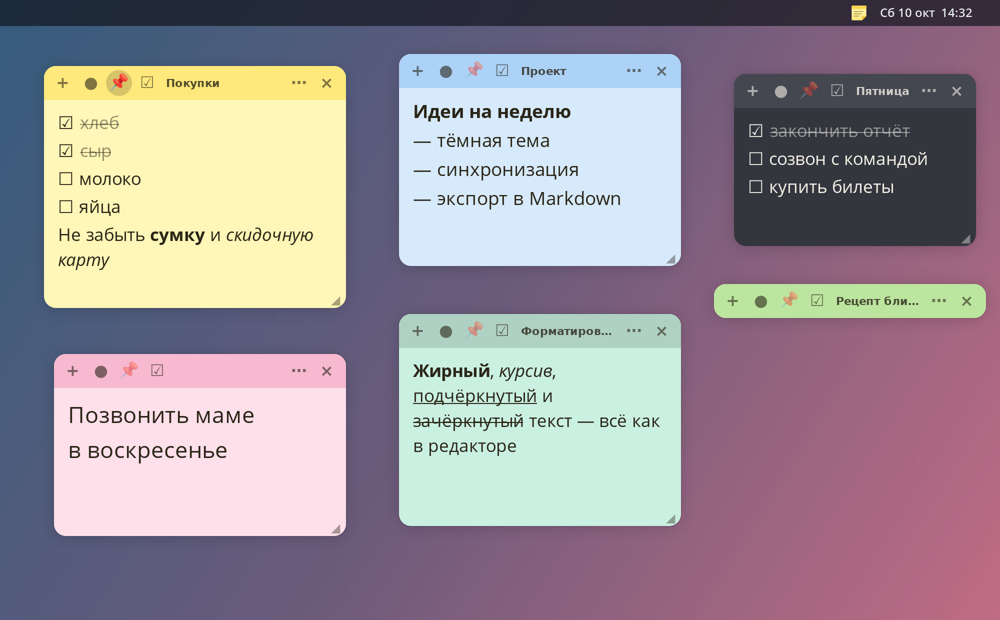
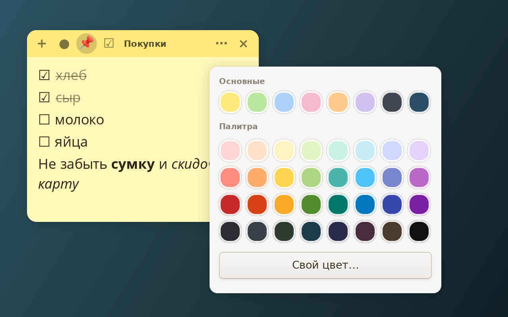
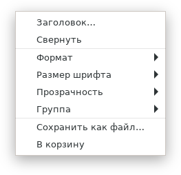
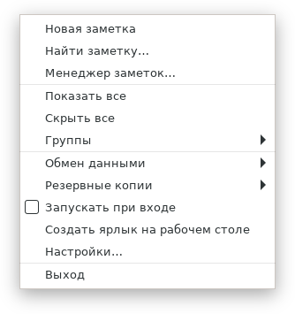
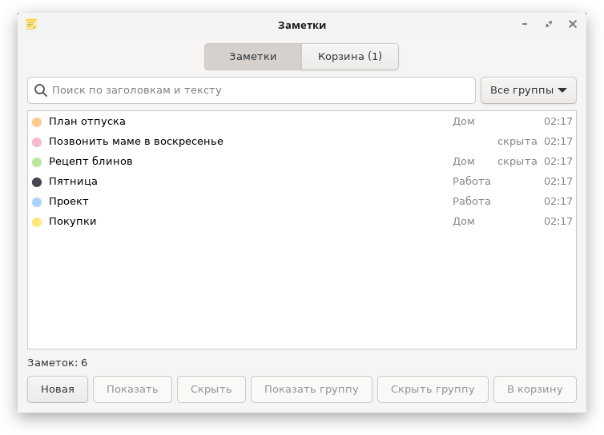
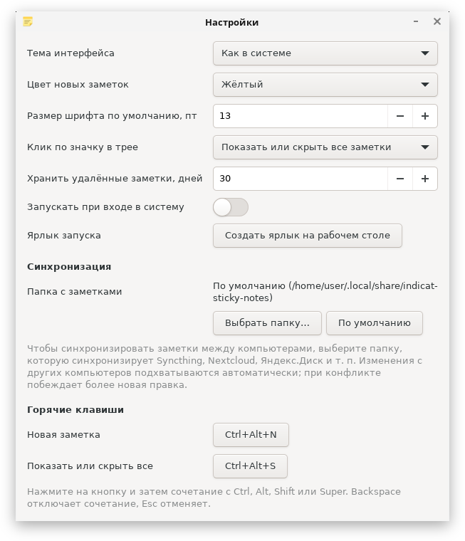

<div align="center">


# Стикеры

**Красивые цветные заметки на рабочем столе Linux.**<br>
Чекбоксы, форматирование, группы, корзина, синхронизация между компьютерами и иконка в трее.

[](https://github.com/h0r1ze/indicat-sticky-notes/actions/workflows/ci.yml)
[](https://github.com/h0r1ze/indicat-sticky-notes/releases/latest)
[](LICENSE)




</div>

Приложение на Python и GTK3 без лишних зависимостей. Идея навеяна [Sticky](https://github.com/linuxmint/sticky) из Linux Mint, но это независимая реализация, код оригинала не использовался.

## Быстрый старт

Скачайте `.deb` со [страницы релизов](https://github.com/h0r1ze/indicat-sticky-notes/releases/latest) (Debian, Ubuntu, Linux Mint):

```bash
sudo apt install ./indicat-sticky-notes_*_all.deb
indicat-sticky-notes
```

Или запустите из исходников (нужны только Python 3.9+, GTK 3 и PyGObject):

```bash
git clone https://github.com/h0r1ze/indicat-sticky-notes.git
cd indicat-sticky-notes
./run.sh
```

Значок появится в системном трее: клик скрывает и показывает все заметки, правая кнопка открывает меню.

## Возможности

### Цвет и дизайн



- Скруглённые листы с мягкой тенью и цветной шапкой
- 8 основных цветов (два тёмных), **дизайнерская палитра из 32 оттенков** и «Свой цвет…» с редактором
- Цвет текста, иконок и выделения **подбирается под фон автоматически**: на тёмном листе текст светлый, контраст не ниже 4.5 (WCAG AA)
- Тёмная тема интерфейса, прозрачность листа, размер шрифта у каждой заметки свой

<br clear="right">

### Пишите как удобно

- **Форматирование:** жирный `Ctrl+B`, курсив `Ctrl+I`, подчёркнутый `Ctrl+U`, зачёркнутый `Ctrl+Shift+X`. Сочетания работают и в русской раскладке
- **Чекбоксы:** кнопка ☑ или `Ctrl+L`, набор `[ ] ` превращается в ☐, Enter продолжает список, клик по квадратику ставит галочку, выполненные пункты зачёркиваются
- **Заголовок** заметки, **закрепление** поверх всех окон (📌), **сворачивание** двойным щелчком по шапке
- Размер шрифта: `Ctrl++`, `Ctrl+-`, `Ctrl+0` или `Ctrl` + колесо мыши

<div align="center">

&nbsp;&nbsp;&nbsp;

</div>

### Порядок в заметках



- **Менеджер заметок:** поиск по заголовкам и тексту, фильтр по группам, выбор нескольких заметок (`Ctrl+A`, `Delete`), найденное подсвечивается в самой заметке
- **Группы:** раскладывайте заметки по группам и показывайте или скрывайте группу целиком
- **Корзина:** удалённые заметки хранятся 30 дней (настраивается) и восстанавливаются; пустые заметки удаляются сразу

<br clear="right">

### Ваши данные в безопасности

- **Резервные копии:** автоматически раз в сутки, вручную в любое место по вашему выбору, восстановление из файла (перед восстановлением делается отдельная копия)
- **Синхронизация между компьютерами:** выберите в настройках папку, которую синхронизирует Syncthing, Nextcloud, Яндекс.Диск и т. п. Правки подхватываются автоматически, при конфликте побеждает более новая; положение окон у каждого компьютера своё
- **Экспорт** в Markdown (с форматированием и чекбоксами) и в `.txt`; **импорт** из `.txt`, `.md`, копий и **Mint Sticky**
- Повреждённый файл заметок не затирается, а откладывается в сторону

### Настройки и горячие клавиши



| Действие | Сочетание |
|---|---|
| Новая заметка из любого места | `Ctrl+Alt+N` |
| Показать или скрыть все заметки | `Ctrl+Alt+S` |

Глобальные сочетания меняются в настройках. Они работают в сеансе X11; в Wayland приложение не может перехватывать клавиши вне своих окон, остальные функции работают как обычно.

В настройках также: тема, цвет и шрифт новых заметок, действие по клику на значок, срок хранения корзины, автозапуск при входе, папка синхронизации и кнопка **«Создать ярлык на рабочем столе»**.

<br clear="right">

## Установка

**Debian, Ubuntu, Linux Mint** — готовый пакет на странице [релизов](https://github.com/h0r1ze/indicat-sticky-notes/releases/latest), или соберите сами (нужны `python3-setuptools` и `dpkg-deb`):

```bash
./packaging/build-deb.sh
sudo apt install ./build/indicat-sticky-notes_*_all.deb
```

**Fedora, RED OS** — spec лежит в `packaging/rpm/` (нужны `rpm-build`, `python3-devel`, `python3-setuptools`):

```bash
git archive --prefix=indicat-sticky-notes-0.2.0/ -o ~/rpmbuild/SOURCES/indicat-sticky-notes-0.2.0.tar.gz HEAD
rpmbuild -ba packaging/rpm/indicat-sticky-notes.spec
```

**Из исходников** понадобятся GTK 3 и PyGObject (Debian/Ubuntu/Mint: `python3-gi gir1.2-gtk-3.0`, Fedora/RED OS: `python3-gobject gtk3`):

```bash
./run.sh                 # запуск
./create-shortcut.sh     # ярлык в корне проекта и в меню приложений
```

Приложение работает в одном экземпляре: повторный запуск просто показывает заметки. Чтобы запустить обновлённую версию, сначала завершите старую (трей → «Выход»).

## Где лежат данные

| Что | Где |
|---|---|
| Заметки | `~/.local/share/indicat-sticky-notes/notes.json` (или выбранная папка синхронизации) |
| Автоматические копии | `~/.local/share/indicat-sticky-notes/backups/` |
| Настройки | `~/.config/indicat-sticky-notes/settings.json` |

## Для разработчиков

Логика проверяется обычными тестами, интерфейс (включая настоящие нажатия горячих клавиш через XTest) в виртуальном X-сервере:

```bash
xvfb-run -a python3 -m unittest discover -s tests -t .   # всё, 160+ тестов
python3 -m unittest discover -s tests -t .               # без дисплея GUI-тесты пропускаются
```

Скриншоты для этого README пересобираются командой `./tools/make_screenshots.sh` (нужны `xvfb-run`, `marco`, ImageMagick и pycairo).

## Лицензия

[MIT](LICENSE)
